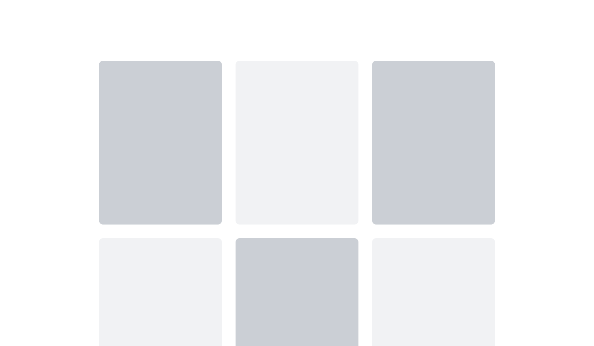

# Getting Started with STYLiSH Front-End using Tailwind CSS

---

In the project directory, you can run:

1. Run `git clone https://github.com/chunyulo-code/tailwind-setup.git`
2. Run `npm install` to install required modules
3. Run `npm run dev` to serve this folder in your browser
4. After `npm run dev` the view in your browser should be like the image below

   

```js
//完整版 tailwind.config.js

/** @type {import('tailwindcss').Config} */
export default {
  content: ["./index.html", "./src/**/*.{js,ts,jsx,tsx}"],
  theme: {
    screens: {
      sm: "480px",
      md: "768px",
      lg: "1280px",
      xl: "1440px"
    },

    extend: {
      colors: {
        darkGray: "#313538",
        selected: "#8B572A"
      }
    }
  },
  plugins: []
};
```

```jsx
//Header.jsx
<div className="w-full h-[102px] lg:h-[140px] fixed top-0 bg-white lg:flex lg:items-center lg:border-darkGray lg:border-b-[40px] lg:px-6 lg:py-5">
  <div className="h-[52px] p-[14px] flex justify-center lg:h-full">
    <a href="https://google.com" className="">
      
    </a>
  </div>
  <ul className="h-[50px] flex justify-center items-center text-l bg-darkGray text-white lg:ms-6 lg:bg-transparent lg:text-darkGray">
    <li className="w-32 text-center border-r-2 border-gray-500 cursor-pointer hover:text-selected">
      女裝
    </li>
    <li className="w-32 text-center border-r-2 border-gray-500 cursor-pointer  hover:text-selected">
      男裝
    </li>
    <li className="w-32 text-center cursor-pointer  hover:text-selected">
      配件
    </li>
  </ul>
  <div className=" hidden lg:flex  lg:ml-auto lg:gap-5">
    <input
      className="rounded-3xl border border-gray-600 text-gray-600 px-2 block w-[214px] h-[44px]"
      type="text"
    />

    <a>
      
    </a>
    <a>
      
    </a>
  </div>
</div>
```
